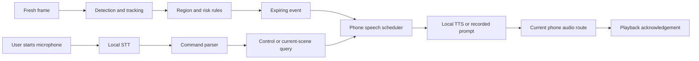

# Historical mobile inference and voice architecture

Original design: 2026-09-25; milestone update: 2026-09-26. At that time local STT, native TTS and phone controls had been implemented, with one audible Bilibili cross-app Q&A test. Revised descriptions/voices still required retesting; Core ML export and formal cloud deployment were not yet complete. **This is historical design context, not the current implementation contract.** Current status is in [on-device implementation](mobile-app-implementation.md), with [legacy voice behavior](ios-voice.md) and [historical implementation notes](vision-and-voice-update.md).

The deployment minimum was iOS 18. Before the voice work, the main app had no STT/TTS/return channel. ReplayKit used `showsMicrophoneButton = false` and accepted only `.video`, discarding microphone/app audio. Screen-sharing permission does not enable the microphone or prove audible phone output.

## 1. Product shape

Present one vision capability, historically SkyCompanion Vision. Keep real model version, weight digest and vocabulary internally for regression/diagnostics, rather than making experimental models everyday options. English labels such as person/car/pole/tree do not change recognition capability; adding a prompt does not mean training or validation occurred.

Separate prompt, deterministic risk feedback from on-demand STT questions. Urgent alerts must not wait for cloud-language-model answers. Start with local TTS and explicit short-command STT, then consider continuous wake detection. Desktop browser audio is not phone-audio delivery; cross-app lifecycle must be resolved.

## 2. Moving YOLO to iPhone

Model migration and reliable execution while DJI Fly is foreground are separate problems. YOLOE authors provide YOLOE-11 reparameterization/Core ML export; fixed text classes are embedded before export, avoiding a runtime text encoder. Vocabulary changes require re-export. [Author export guide](https://github.com/THU-MIG/yoloe#export), [Ultralytics export](https://docs.ultralytics.com/models/yoloe/#export-usage).

| Source | Proposed on-device route | Historical boundary |
|---|---|---|
| App-owned camera | AVFoundation → Core ML/Vision → risk/TTS | Good initial offline test, while capture is permitted |
| App-owned local video | AVPlayer output → identical preprocessing/Core ML | Reproducible boxes, masks and performance |
| DJI Fly/Bilibili foreground | ReplayKit frames, then still sent to Mac; extension inference a separate experiment | Main app may suspend. App Groups/socket traffic do not grant wake/background computation |

Apple does not offer general perpetual background computation, fixed periodic scheduling or arbitrary IPC/network wake. Extensions have tighter resource budgets. The often-quoted 50 MB is not a universal permanent guarantee; measure peak memory/Jetsam on target hardware. The historical plan did not assume inference/STT/TTS could all be placed in the extension. [Background execution](https://developer.apple.com/forums/thread/685525), [extension resource guidance](https://developer.apple.com/library/archive/documentation/General/Conceptual/ExtensibilityPG/ExtensionCreation.html#//apple_ref/doc/uid/TP40014214-CH5-SW3).

Historical migration sequence:

1. Freeze candidate weights, English vocabulary, proposed 640 input, thresholds, NMS, preprocessing and SHA256/provenance. Begin FP16; evaluate quantization separately. The later selected model is 960 FP16, documented elsewhere.
2. Export `.mlpackage` in a separate Mac environment using the same fixed-prompt Ultralytics version. Installed 8.4.37 accepts half/int8; do not mix newer online arguments/models into that toolchain.
3. Define FrameSource, VisionEngine and DetectionResult. Keep one processing/one latest pending frame. Decode boxes/classes/masks and verify letterbox/orientation/ROI; do not assume automatic compatibility with custom YOLOE output.
4. Compare clean identical PNGs against Python, reviewing poles/trunks/bins/fences/small objects separately. Export success is not preserved accuracy.
5. Measure iPhone 15 Plus cold start/warmup, FPS, P50/P95, memory, 15-minute thermals, battery and compute device, then repeat with capture/STT/TTS concurrent. Compare `.all` and `.cpuAndNeuralEngine` without claiming every operator uses ANE.
6. After foreground validation, test the smallest extension inference path. The historical external-compute fallback was a proposal; the later phone-only delivery agreement requires reporting a blocker rather than silently reverting to Mac/cloud.

Tools: Swift, SwiftUI, AVFoundation, Vision, Core ML; Python/Ultralytics/coremltools for export. [Core ML guide](https://docs.ultralytics.com/integrations/coreml) is a deployment reference, not measured SkyCompanion performance.

### Direct Neo 2 connection

The user connects iPhone directly to Neo 2 without a controller. An ordinary-Wi-Fi Bilibili test does not establish Mac reachability after switching to drone Wi-Fi. Record both actual network paths and bidirectional latency. On-device inference reduces external video-transfer dependence, but not iOS lifecycle constraints. Cellular/controlled relay/wired alternatives require independent routing/outage/cost tests. Do not assume simultaneous phone hotspot and drone Wi-Fi or that Mac can join Neo 2. Loss of alert delivery must invalidate guidance rather than reuse cached directions.

## 3. Two voice paths



Historically cross-app vision/risk ran on Mac, returning events to phone; foreground offline mode proposed phone vision. The web page was diagnostic, not a required audio path. Extension capture/upload and main-app speech were separate. Background reception/playback required lifecycle experiments.

### Local TTS

Use a single serial AVSpeechSynthesizer scheduler; fixed prompts could be prerecorded rather than repeatedly generated remotely. Before starting, audition and identify the intended route. Headphone loss should pause ordinary scene speech rather than suddenly disclose it on speaker. Evaluate playback/voicePrompt first and playAndRecord for recording; test duck/pause/resume alongside DJI Fly/Bilibili/Bluetooth/VoiceOver. Delegate callbacks are software events, not exact acoustic onset; use synchronized recording for end-to-end latency.

References: [voicePrompt](https://developer.apple.com/documentation/avfaudio/avaudiosession/mode-swift.struct/voiceprompt), [mixing spoken audio](https://developer.apple.com/documentation/avfaudio/avaudiosession/categoryoptions-swift.struct/interruptspokenaudioandmixwithothers), [speech synthesizer](https://developer.apple.com/documentation/avfaudio/avspeechsynthesizer). These APIs do not guarantee arbitrary background sockets remain alive.

### Explicit short-command STT

| Stage | Historical first iteration |
|---|---|
| Entry | Foreground Hold to talk, VoiceOver labels/focus/actions, release to end, always available stop |
| iOS 26+ | SpeechAnalyzer/SpeechTranscriber, runtime language/device/resource checks |
| iOS 18 | SFSpeechRecognizer, supportsOnDeviceRecognition then requiresOnDeviceRecognition; explicit unavailable state, no silent upload |
| Audio | AVAudioEngine, format conversion, VAD/duration bound, microphone/speech permissions |
| Parse | Finite Pause/Resume guidance, Repeat, What is ahead, Stop speaking; confirm uncertain intent and recheck repeated evidence |
| Questions | Local operational state and timestamped observations; optional cloud Q&A isolated so timeout/cancellation cannot block risk |

Local transcription may need an initial language download. An iOS 18 project does not automatically support iOS 26 APIs. [SpeechAnalyzer](https://developer.apple.com/videos/play/wwdc2025/277/), [on-device requirement](https://developer.apple.com/documentation/speech/sfspeechrecognitionrequest/requiresondevicerecognition).

An ordinary background app cannot promise to start recording from a Bluetooth press while DJI Fly is foreground. Initially restrict press-to-talk to the app; then test a real session explicitly started before switching. No fake calls, silent playback or arbitrary push workaround. [Apple background-recording discussion](https://developer.apple.com/forums/thread/816408).

| Mode | Microphone entry | Processing | Required checks |
|---|---|---|---|
| A: foreground camera/video | User starts/stops in app | Local STT → query/control → TTS → headphones | VoiceOver, resources, route, echo, interruption |
| B: DJI Fly foreground, ReplayKit | Start voice assistance in app before leaving | Genuine continuous background-audio purpose, local listening, incoming risk/TTS | Broadcast/audio coexistence, long silence, calls, competing audio, Bluetooth, low power, force quit |

Apple's record category documents continued background recording with audio mode and generally recommends playAndRecord to avoid suppressing other output. This supports start-then-continue, not arbitrary restart or uninterrupted operation. [Recording category](https://developer.apple.com/documentation/avfaudio/avaudiosession/category-swift.struct/record?changes=_1), [user-controlled audio sessions](https://developer.apple.com/library/archive/documentation/Audio/Conceptual/AudioSessionProgrammingGuide/AudioGuidelinesByAppType/AudioGuidelinesByAppType.html).

Mode B sequence:

1. Add main-app microphone/speech permissions, background audio, AVAudioEngine and session coordination. Keep ReplayKit microphone off so video dialogue is not conflated with user input.
2. Announce listening after foreground start; show microphone state. Default no audio storage. Recording serves actual selected voice assistance, not a pretext to keep a visual socket alive.
3. Test playAndRecord routes/mixing. Do not permanently duck other media; coordinate short prompts and recovery with DJI Fly/Bilibili/VoiceOver.
4. Gating transcription within an active session still means the microphone remains on. Truly stopping it may require returning to the app to restart; generic Bluetooth buttons do not guarantee reopening.
5. Check actual recovery after interruption. If unavailable, report it; do not claim listening. Force quit/user stop never silently reopens the microphone.

Validate A first and attempt B feasibility early. Foreground camera success does not fulfill DJI cross-app delivery. Future local wake detection plus brief transcription windows still needs a valid audio session. Headset/custom-button routing needs real tests; push-to-talk alone is not a delivered hands-free experience.

### Avoid self-triggered speech

Begin half-duplex: explicit recording cancels low-priority TTS, and TTS audio cannot execute commands. Verified urgent risk can suspend Q&A. Later echo/barge-in work must distinguish user stop, conversation, media and TTS echo; substring matching stop is insufficient. VoiceOver remains the UI access mechanism, not replaced by TTS. Do not make every detection a live announcement; respect speech rate and focus on changes/queries. [Accessibility speech cooperation](https://developer.apple.com/videos/play/wwdc2020/10022/).

## 4. Historical event proposal

This was a proposed protocol, not a declaration of the current interface:

```json
{
  "type": "guidance_event",
  "event_id": "unique-id",
  "session_id": "capture-session",
  "revision": 4,
  "frame_id": 9952,
  "captured_device_uptime_ms": 2501234.5,
  "priority": "path_obstruction",
  "track_id": "track-42",
  "evidence": {"path_overlap": 0.42, "label_verified": false},
  "template": "obstacle_unconfirmed",
  "direction_frame": "camera",
  "direction": "ahead",
  "max_observation_age_ms": 1500,
  "locale": "en-US"
}
```

1500 ms was an initial engineering parameter requiring latency/error evaluation. Phone templates whitelist speech rather than reading arbitrary server hazard text. Historical candidates included Obstacle ahead. Type unconfirmed. and Path blocked. Please stop and check. They are design proposals, not instructions enabled by absent evidence. Do not assert an unvalidated train class.

| Historical priority | Scheduling proposal |
|---|---|
| Perception failure / verified high risk | Interrupt descriptions/questions, clear invalid results; later implementation separates health from danger |
| Path obstruction | Require stable occupancy, deduplicate, permit changed/escalated evidence |
| Command/Q&A | Short, cancellable, cannot obstruct critical events |
| Optional description | On request or meaningful change; retain only latest valid description |

These are design rules to test with blind users, not danger inferred directly from COCO labels. Required invariants: clear old events on source/orientation/ROI/model/session change; recheck expiry/tracks/corridor/audio before speech; queue wait does not renew evidence; throttle across targets while permitting escalation; never replay expired backlogs. Empty detections do not imply safe to cross. A traffic-light class does not establish color or pedestrian permission. Drone image directions need a camera-to-user transform before becoming body-relative.

### Historical return channel

Bound video upload; use a separate paired guidance WebSocket to avoid image backlog. Remote experiments would additionally require WSS/limited sessions, without exposing keys in web logs. Return received/speech_started/speech_finished/cancelled/expired with event/session/frame IDs. Preserve captured phone systemUptime and measure same-boot capture-to-callback intervals; never subtract Mac/phone wall clocks. Actual acoustic P50/P95 requires synchronized timecode/audio and headphone recording, not browser drawing acknowledgements.

## 5. Privacy and costs

The original proposal kept vision on Mac or future phone, STT/TTS local, transient buffers unsaved by default, and separately explained user-saved error evidence. Optional cloud questions must specify whether text/audio/selected frames are transmitted and remain off without opt-in. Apple on-device speech avoids this design's per-minute cloud calls but uses download/storage/memory/battery/maintenance. Cloud budgets depend on provider/model/region and actual minutes/characters; do not invent fixed costs. Distinguish local risk operation from unavailable visual input during outages.

## 6. Historical implementation/acceptance sequence

| Phase | Work | Evidence required |
|---|---|---|
| V0 | Audio coordinator/TTS, manual events, pure TTS versus genuine prestarted listening, switch apps and wait 30/120 seconds | Actual headphone output, suspension/calls/Bluetooth/lock/network behavior without debugger; fix lifecycle first |
| V1 | Structured events, client/scheduler, priority/expiry/cancel/ACK | No stale/repeated backlog; valid-frame traceability and risk interruption in supervised video |
| V2 | Foreground English STT, router, offline resources/VoiceOver | Command success, false triggers, noise, echo, cancellation and real device/language support |
| V3 | Export/Swift inference/local video and camera | Same-frame accuracy, actual FPS/thermal/memory; desktop 15 fps is not a phone result |
| V4 | Cross-app speech and available compute | 15-minute simultaneous video/vision/speech, visible loss/recovery. Historical Mac fallback is superseded by the later phone-only acceptance contract |
| V5 | Co-design with blind/low-vision users | False/missed alerts, first understandable warning, control success, separate detector precision/recall |

Foreground clips can validate V1–V3 if cross-app audio fails, but do not replace DJI acceptance. Background-mode declarations, builds and computer audio are insufficient delivery evidence.

## 7. Useful primary references

| Project | Mechanism to study | Limit |
|---|---|---|
| [Project Guideline](https://github.com/google-research/project-guideline/blob/main/README.md) | Separate perception/path/audio, explicit tracking-loss signal, simulator | Constrained colored guide lines, not arbitrary city navigation |
| [Soundscape source](https://github.com/microsoft/soundscape), [project note](https://www.microsoft.com/en-us/research/product/soundscape/) | Spatial beacons and on-demand landmarks reduce continuous narration | Map/location awareness, not YOLO avoidance; ended research project, not assumed maintained service |
| [Lookout guide](https://support.google.com/accessibility/android/answer/9031274?hl=en) | Separate find/read/describe intents, focused feedback | Commercial features do not supply training weights/data or prove iPhone distance performance |
| [Be My Eyes glasses FAQ](https://support.bemyeyes.com/hc/en-us/articles/29893014835729-Meta-AI-Glasses-FAQ) | Voice entry, explicit connection/end state, human confirmation | Interaction reference only, not weights or authorization to contact anyone |
| [WalkVLM / WalkStream](https://github.com/xiaoyuan1996/walkvlm) | Fast perception plus low-frequency language, evaluate when/what to say | Fluent language is not reliable walking guidance; historical training reference in obstacle-awareness-plan.md §5.7 |

Combine on-device YOLO, separated perception/control/audio, short direction feedback and explicit task modes. Fix unknown classes through clean samples, independent annotation, per-class evaluation and training; language cannot make missed detections correct.
