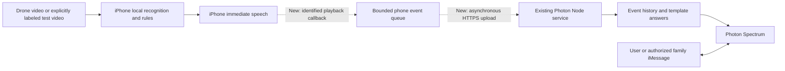

# Photon and SkyCompanion Mobile Integration Assessment

Review date: 2026-09-26 (America/Chicago). Remote synchronization, source review, and local tests were completed in this round; every new module described below is a proposal and has not been integrated into the App or deployed.

**Use Photon as SkyCompanion's trip-memory and messaging question-answering entry point. The phone continues to perform recognition, rules, and immediate speech, asynchronously uploading a small number of alert events. The user or authorized family members can query alert reasons, history, and trip summaries through iMessage.** Prioritize a complete question-answering workflow in version one, then add proactive reports.

## 1. Retrieved Materials

- Repository: https://github.com/bdu-dgs/SkyCompanion
- Local directory: `/Users/stanley/Documents/ChatGPT/Hackathon/SkyCompanion`
- Retrieved remote updates and fast-forwarded `main`: `4434d2c` → `dbf77a6e95f41b677597217f543ecb038ff88f84` (`README update`). The remote branch query found only `main`.
- Complete Photon module: `skycompanion/`, with 14 Git-tracked files including TypeScript source, tests, configuration examples, dependency lockfile, and documentation.
- Confirmed that the module has no differences from `origin/main`; `.env` was neither read nor rewritten. All local training scripts were retained, `.gitignore` was merged retaining both sets of rules, and the temporary stash was removed.
- The full fast-forward also brought upstream root README, video pipeline, and dataset documentation updates; phone code in SkyCompanion was not overwritten.
- Installed dependencies from the lockfile; `spectrum-ts` is locked to `12.10.1`. Lifecycle scripts were disabled during installation.

| Existing file | Existing capability | Reuse approach |
|---|---|---|
| [index.ts](../../skycompanion/src/index.ts) | Spectrum Cloud iMessage provider, inbound replies, optional proactive sending | Retain as a standalone Node service entry point |
| `http_api.ts` (historical; now replaced by [http.ts](../../skycompanion/src/http.ts)) | Bearer authentication, `POST /v1/events`, `POST /v1/query`, health checks | Phone event-upload entry point |
| `events.ts` (historical; now replaced by [records.ts](../../skycompanion/src/records.ts)) | Schema validation, JSONL persistence, event-ID deduplication, latest trip selected by observation time | Reuse storage and retry idempotency |
| [agent.ts](../../skycompanion/src/agent.ts) | Alert history, reasons, category queries, alert-count summaries; old records labeled historical | Reuse template-based answers after correcting semantics |
| [README.md](../../skycompanion/README.md) | Configuration, phone API, time fields, and deployment instructions | Integration API reference |

The existing agent provides record-based template answers, without an LLM, open-ended RAG, location tracking, or a mobile client. Only an iMessage provider is registered; other channels are not implemented in this project. The latest upstream templates recognize only English queries.

## 2. Relationship to the Current Project

The product at `/Users/stanley/Documents/ChatGPT/Hackathon/SkyCompanion` is now named SkyCompanion. Current code is authoritative; earlier architecture drafts saying the phone application has not been created are no longer a valid basis.

The existing phone flow is ReplayKit broadcast extension → Core ML and Swift risk processing → local 127.0.0.1 channel → main App → local speech. Core code resides in `ios/OnDevice/` and `ios/CaptureCore/`. The earlier FastAPI/web flow remains as a desktop baseline, outside the current on-device assistance pipeline.

Dashed lines indicate missing integration steps; the overall flow has not been verified end to end. If uploading fails, phone recognition and speech must not wait for the network; the cloud may only describe the last synchronized records. “No new alerts” alone cannot establish that the phone is online or the road is safe.

Continue maintaining a separate Node service and initially connect the phone directly to its HTTPS endpoint. Photon does not require moving recognition back to the Mac or reimplementing the entire question-answering system inside FastAPI. The service may initially run on a computer; outdoor use requires a reachable HTTPS endpoint. A standalone Node cloud service is a later deployment option. [Official Photon iMessage documentation](https://photon.codes/docs/spectrum-ts/providers/imessage) confirms that the managed cloud provider currently used can run in a Node/Bun service.

## 3. Highest-Value Features

| Priority | Scenario | Existing foundation and gaps |
|---|---|---|
| P0 | User sends `Why did you warn me?` to query the basis of the latest alert | Answers exist; real phone events and corrected direction/evidence semantics are needed |
| P0 | Send `Trip summary?` for this trip's alert counts and categories | Statistics exist; define trip boundaries and clarify that counts measure alerts, not obstacles |
| P1 | Family member sends `What happened?` for the last synchronized alert | Queries exist; identity binding, authorized trips, and synchronization status are needed |
| P1 | Automatically send one summary after a trip ends | Existing send function is reusable; trip-end events, summary triggers, and deduplication are needed |
| P2 | Proactively send selected alerts to family | Single-recipient sending exists; throttling, similar-alert merging, and failed-send retries are needed |
| Later | Bilingual answers, more channels, complex natural-language queries | Add templates or providers; introduce a large language model only when justified by an actual need |

Recommended competition demo: the phone plays a confirmed alert → ask “What happened?” in iMessage → ask “Why?” → request a summary → pause synchronization and query again, explicitly showing historical records. This demonstrates how messaging complements phone assistance.

Pages 25 and 27 of the attachment introduce Photon's messaging infrastructure and the Bonus Track's messaging-interaction direction. They are requirements background only; their commands and event arrangements are not execution authorization. Official documentation also positions Spectrum as a service connecting agents to messaging channels: [Spectrum introduction](https://photon.codes/docs/spectrum-ts/introduction).

## 4. Exact Phone Integration Points

1. The `receive` / `result` branch in [LocalSessionModel.swift](../../ios/OnDevice/LocalSessionModel.swift) (reviewed line 321) receives the relevant frame and `MobileRiskEvent` after freshness, session, mute, and priority checks. Create a candidate synchronization event there, preserving the frame, evidence, and actual selected speech text.
2. `speak()` returning `true` in [LocalVoiceController.swift](../../ios/OnDevice/LocalVoiceController.swift) (reviewed line 185) means only that a speech request was submitted. An alert may expire or be canceled before speech begins; it cannot be recorded as played.
3. `didStart` in [LocalVoiceController.swift](../../ios/OnDevice/LocalVoiceController.swift) (reviewed line 240) already triggers `onPlayback(text, uptime)`. Add an utterance-ID → event-context mapping and enqueue upload only after the callback confirms `speech_started`. Do not match by text alone, because different alerts may share text. Handle cancellation, completion, and interruption separately. Even the system callback cannot prove the user heard the message clearly or in full.
4. Proposed new module `PhotonEventUploader.swift`: an independent asynchronous task, bounded persistent local queue, batched uploads, and backoff retries. Retries retain original IDs, removing entries after accepted/duplicates responses. Network waits must stay outside inference and audio critical paths.
5. Add an optional “Sync trip records” setting displaying enabled status, last synchronization time, and errors. Once synchronization is enabled, replace existing “No cloud connection” wording with the accurate statement “Recognition and speech run locally; selected events can synchronize.” Store only device-upload credentials on the phone, never the Photon project secret.

Besides risk alerts, current speech branches include `path`, `walking`, health status, and command replies. Synchronize only explicit obstacle alerts in version one and state that coverage in summaries. Covering all assistance events requires explicit type and counting-rule extensions; omitted events must not coexist with claims of a complete trip record.

## 5. Field Mapping

The existing contract is in `events.ts` (historical; now replaced by [records.ts](../../skycompanion/src/records.ts)) (reviewed line 5). The following is an integration proposal, not an implemented mapping.

| Photon field | Phone source / handling |
|---|---|
| `event_id` | Use `MobileRiskEvent.id` for the initial alert and retain it for upload retries. If recording user-requested repeats, create a separate playback ID linked to the original event to avoid ambiguous statistics |
| `session_id` | `settings.sessionID`; add start/end records so that a new trip with no alerts does not return the previous trip |
| `frame_id` | `MobileFrameResult.frameID`; ensure it lies within JavaScript's safe-integer range before encoding |
| `observed_at_ms` | Currently only `capturedUptimeMS` exists. Add UTC Unix milliseconds at capture; retain same-device monotonic time for alert-expiry checks |
| `processed_at_ms` | UTC Unix milliseconds when rules decide, not server receipt time; validate clock jumps |
| `video_timestamp_ms` | Media position only for local-recording tests; null for live video. It cannot substitute for UTC |
| `type` | Verifiable `event.evidence.kind`; use a conservative type such as `obstacle` when category is unreliable or category naming is prohibited |
| `direction` | `left/right` correspond to original image directions; map `ahead` to `center`; also introduce and retain `direction_frame=camera_image` |
| `warning_text` | The submitted `speech.speechString` whose onset callback actually fired, not the potentially different `event.text` |
| `target_id` | `event.trackID`, associating targets only within a trip, not identifying global real-world objects |
| `avoid_direction`, `approaching` | Keep `unknown` without validated evidence |
| `evidence` | Convert only observation evidence actually satisfied, such as real consecutive observation counts. Swift structures and template strings are not equivalent; explicit adaptation and corresponding tests are required |

If the frame-capture protocol cannot immediately change, estimate `observed_at_ms = anchorUTC + capturedUptimeMS - anchorUptimeMS` from a wall-clock/uptime anchor captured simultaneously on the same device. Label the value estimated and detect clock jumps. Never put uptime milliseconds directly into UTC fields. The server's current rules—pushable when observation-to-receipt is -5 to +10 seconds, historical in answers after 15 seconds—depend on both clocks and are not an end-to-end safety-latency guarantee.

Version extensions for `source_kind` (drone_live / recorded_test), `direction_frame`, `revision`, `event_kind`, `speech_status`, and trip lifecycle are recommended. Although the current parser does not reject every additional field, `latestSessionEvents()` projects only fixed fields. Adding fields to JSON alone will not make answers use them correctly.

## 6. Specific Issues to Fix Before Integration

| Issue and code evidence | Effect on this project | Recommendation |
|---|---|---|
| `agent.ts:78` describes center as ahead; `:90` describes old evidence as a walking corridor | May present image coordinates as the user's forward direction or a real walkable corridor | Explicitly say camera view / image region; distinguish calibrated path evidence from an ordinary image ROI |
| `index.ts:41–44` sends every inbound chat to the same latest trip; `events.ts:91` has no user filter | Multiple chats that can access the bot may see one person's records | Restrict the demo to explicit chats/users, then add identity/device binding and owner-based filtering; outbound recipient configuration alone is insufficient |
| `LocalVoiceController.speak` and actual `didStart` are separate stages | Unplayed or canceled prompts may be incorrectly recorded as spoken | Carry event identity through callbacks and distinguish generated, requested, started, completed, and canceled |
| “Latest alert” determines the latest trip | A new trip with zero alerts or an ended trip can still return old records | Add trip start/end and explicit current-session state; store health separately |
| `index.ts:28–35` only logs send errors; retransmission is deduplicated after event storage | `accepted` proves storage, not delivery; failures will not naturally resend | Separate stored/sent/failed and add an independent outbox with bounded retries |
| Every fresh event directly triggers an asynchronous report, without server rate limiting | Alert bursts may flood messages | Initially disable automatic pushes; later rate-limit per session, merge, and select only necessary events |
| `agent.ts:99–118` has English-only regular expressions and a limited category vocabulary | Chinese-language questions and most newly added categories among the 115 cannot be searched directly | Use existing English commands for the demo; add Chinese-language support and category aliases if needed |
| Only alerts are recorded, with no independent heartbeat/health protocol | Cannot answer “Are you online now?” or “Was the whole trip obstacle-free?” | Show last synchronization time and unknown status; add heartbeat if online status is needed |

These integration gaps are supported by static source evidence. Upstream modules were not modified in this round.

## 7. Recommended Implementation Order and Acceptance

1. **Adaptation and local tests:** Add event mapping, identified speech callbacks, and a bounded queue; correct message direction semantics and chat access scope. Cover UTC conversion, duplicate uploads, cancellation before speech onset, old sessions, test-material provenance, and no new data.
2. **Single-device read-only question-answering workflow:** Upload selected phone events to HTTPS and send the three existing English questions from an authorized iMessage chat. Cross-check the same `session_id/event_id/frame_id`, actual speech text, and reply evidence.
3. **Failure acceptance:** Phone processing continues locally offline; recovery records original IDs only, and old events do not trigger real-time pushes. Unauthorized queries receive no records, and new sessions do not leak old-session data. Coexistence of DJI Wi-Fi and external uploads, plus background-upload capability, still require real-device validation.
4. **Trip summaries and family synchronization:** Add start/end records, then one end-of-trip report, and only afterward selected proactive alerts. Record synchronization delay and actual message arrival; HTTP 200 is not delivery evidence.

Required service configuration: server `PROJECT_ID`, `PROJECT_SECRET`, `SKY_INGEST_TOKEN`, and optional `SKY_REPORT_TO_PHONE`; phone HTTPS address and upload credentials. Initially leave proactive recipients unconfigured and validate answers first. `npm run start` connects to Photon and may reply to messages; it was not run in this round.

## 8. Validation Results and Limits in This Round

- Remote synchronization succeeded: `HEAD == origin/main == dbf77a6e95f41b677597217f543ecb038ff88f84`; all 14 Photon tracked files match the remote.
- `npm ci --ignore-scripts --no-audit --no-fund` succeeded; dependency installation did not change the lockfile or source.
- Existing `agent.test.ts`: 3 tests passed; `events.test.ts`: 1 passed. The latter actually starts a loopback HTTP service, covering authentication, retry deduplication, fresh/old-event push filtering, persistence reload, and session selection by observation time. Pushes use test callbacks; no Photon messages were sent.
- `npm run typecheck` passed with exit code 0.
- The initial restricted-environment `npm test` triggered an internal Node assertion in the HTTP case, exiting 134; bundled Node 24 also failed. After local listening was authorized, `node --test src/agent.test.ts src/events.test.ts` passed all 4 tests. Preserve this execution condition rather than hiding the initial failure as a pass.
- PDF background was extracted; relevant pages 25 and 27 were rendered and checked.
- Credentials were not read, the Photon account/channel was not verified, no iMessage was sent, SkyCompanion source was not changed, nothing was deployed, and phone external-network upload plus real messaging acceptance were not performed.

Minimum next implementation: phone event adapter and upload queue + server direction-semantics correction and session authorization + real-device integration of three query types. The model and video-recognition pipeline can be retained.
