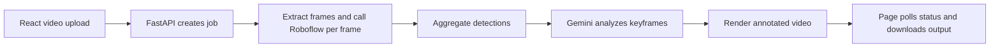
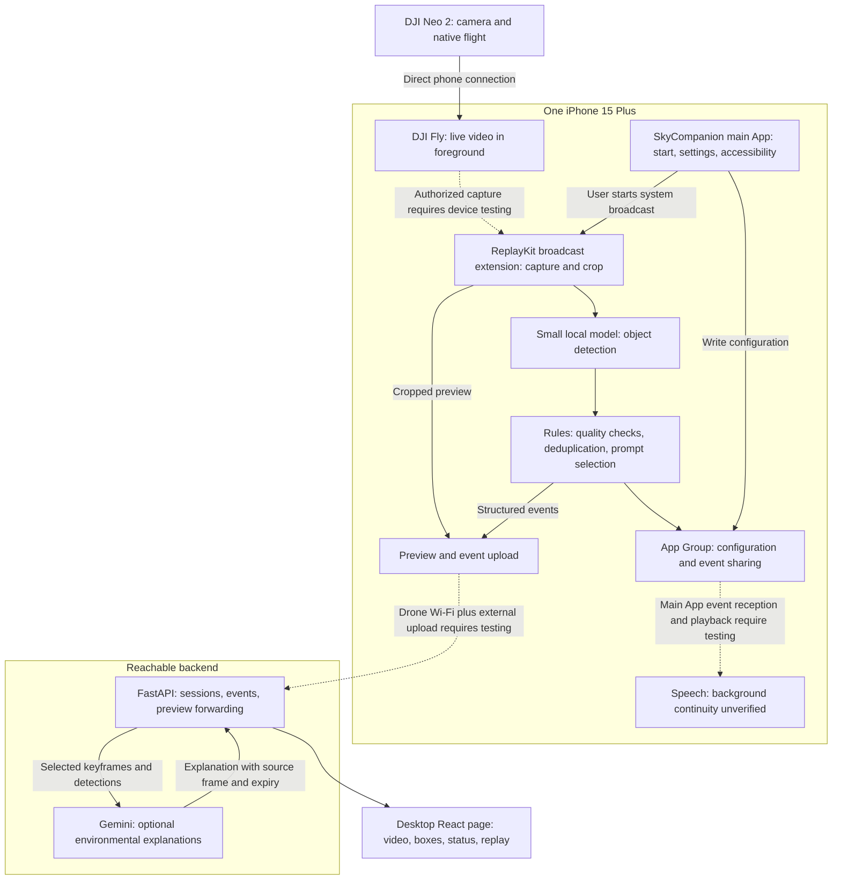

# SkyCompanion Drone Guidance Copilot: Architecture

Updated: 2026-09-25. Based on the related chat about planning a DJL drone guidance Copilot, current SkyCompanion source, and official DJI/Apple materials. This document describes the target architecture and implementation boundaries; real-device validation has not been completed.

Recommended design: **The drone supplies the view, the iPhone performs basic perception and prompts, and the backend connects a desktop viewer and provides optional scene explanations.** Basic phone functionality is intended to work without a computer or cloud. Feasibility depends on validating frame capture, extension resources, and background speech.

## 1. Established Scope

- Hardware remains the DJI Neo 2 from the earlier discussion, with the user-confirmed iPhone 15 Plus running iOS 18.7.8.
- The user carries only the drone and one phone, without a controller or second phone.
- The phone receives drone video and provides assistance prompts; a computer can view it simultaneously, inspect recognition, and demonstrate the system.
- Native DJI capabilities handle flight. SkyCompanion's first phase covers perception and prompts, not autonomous flight control.
- First-phase output is limited to environmental observations such as “A pedestrian was detected in the camera view.” Direction and action prompts require validated user coordinates, distance, and path judgments first.

DJI's current official compatibility table lists Neo 2 as unsupported by the SDK, while phone-control documentation describes phone control and following. Therefore the architecture uses DJI Fly for reception and validates system screen-broadcast frame capture; it does not depend on direct video or flight-control interfaces absent from this project. [DJI SDK compatibility](https://repair.dji.com/help/content?customId=01700000763&lang=en&paperDocType=ARTICLE&re=US&spaceId=17), [DJI phone-control instructions](https://repair.dji.com/help/content?customId=01700011389&lang=en&paperDocType=ARTICLE&re=US&spaceId=17).

## 2. Actual Current SkyCompanion Capabilities

Current code describes skiing obstacle analysis, primarily through offline video jobs:



| Existing module | Code evidence | Role in the new architecture |
|---|---|---|
| React upload, progress, and download page | [App.jsx](../../frontend/src/App.jsx), reviewed line 61 | Convert to a desktop monitoring console while retaining playback |
| FastAPI job orchestration | [main.py](../../backend/app/main.py), reviewed line 71 | Retain offline jobs; add live sessions, events, and preview forwarding |
| Roboflow detection calls | [roboflow_workflow.py](../../backend/app/roboflow_workflow.py), reviewed line 175 | Offline baseline and comparison; phone execution requires separately obtaining and validating a model |
| Detection format | [detections.py](../../backend/app/detections.py), reviewed line 6 | Reuse category, confidence, and box-coordinate concepts; add session, frame ID, and validity |
| Gemini scene summary | [gemini_summary.py](../../backend/app/gemini_summary.py), reviewed line 92 | Make environmental explanations optional; revise skiing prompts and output constraints |
| Video rendering and frame extraction | [README.md](../../README.md), reviewed line 86 | Regression assessment, demo replay, and training-data preparation |

The “Connect DJI Neo 2” button currently only sets page state and does not establish a device connection; see [onAutoConnect](../../frontend/src/App.jsx), reviewed line 108. No native iOS project was found in the repository at this review. Live capture, phone inference, and continuous speech all need to be added.

Another semantic issue to fix in the live architecture: current Roboflow call failures can produce output using empty detections. The new system must distinguish successful analysis with no detected objects from failed/not-yet-performed analysis, and must not display the latter as a safe road.

## 3. Target Runtime Architecture

Everything below represents the proposed system. Dashed lines mark connections requiring priority validation; other arrows do not imply implementation either.



Prioritize validation of capture, model, and rules inside the broadcast extension's processing pipeline, because the SkyCompanion main App cannot be assumed to execute continuously while DJI Fly is foregrounded. Whether the model fits in the extension depends on actual peak memory, inference time, encoding overhead, and thermal tests.

Apple ReplayKit broadcast extensions can receive video samples; this does not prove that DJI Fly's video region can be captured continuously. [Apple ReplayKit](https://support.apple.com/en-gb/guide/security/seca5fc039dd/web).

**Background speech is a prerequisite for this architecture.** App Groups share data but do not keep the main App alive; adding background audio mode directly to the broadcast extension is not a solution. The proposal is to validate a system-compliant audio session in the SkyCompanion main App, but background-audio configuration alone cannot prove that intermittent events can continue to trigger speech. [Apple extension restrictions](https://developer.apple.com/library/archive/documentation/General/Conceptual/ExtensibilityPG/ExtensionCreation.html).

## 4. Responsibilities by Layer

| Layer | Input and output | Implementation points |
|---|---|---|
| Video input | Screen samples → cropped frames | Confirm DJI Fly video region, orientation, occlusion, and quality; retain only the newest pending frame |
| Visual perception | Frame → categories, confidence, boxes | Small local model; first validate a few categories supported by pretrained weights |
| Temporal association | Consecutive detections → stable target events | Cross-frame confirmation, simple association, duplicate-target merging; avoid one spoken alert per frame |
| Prompt decision | Target events + system health → prompt events | Explicit thresholds, cooldowns, and failure rules; unknown when evidence is insufficient |
| User interaction | Prompt events → speech and action feedback | Speech priority, expiry discard, audio-interruption recovery, VoiceOver; separately accept background availability |
| Remote viewing | Preview + events → desktop page | Match frame IDs to boxes, show update time, discard old previews on slow networks |
| Scene explanation | Selected frames + detections → brief explanation | Gemini on demand or at low frequency, asynchronous; do not block basic prompts or replace rules |
| Offline training and assessment | Labeled data → validated model | Train on a computer; fix the test set and record model/preprocessing versions before phone deployment |

Local inference may retain YOLO11n from the earlier discussion as a baseline candidate and validate it after Core ML export. This is not a new recommendation for a larger model, nor proof of stable operation inside this broadcast extension. [Official YOLO11](https://docs.ultralytics.com/models/yolo11), [Core ML export](https://docs.ultralytics.com/integrations/coreml).

Add steps, curbs, and potholes only after validating or fine-tuning the relevant model capabilities; adding names to the interface is not support. Training data must reproduce final cropping, resizing, and video-link quality. Split training, validation, and test data by location and video, avoiding neighboring frames across subsets.

## 5. What Is Missing Between Object Recognition and Guidance for Blind Users

Object detection provides image coordinates. Turning this into “an obstacle ahead of the user” requires at least:

1. The relationship between user position, travel heading, and camera.
2. Target-ground geometry and validated distance estimation.
3. Whether the user's future travel region intersects the obstacle.

Phone orientation, drone orientation, and human travel direction may differ. A monocular detection box cannot directly yield reliable meters. These inputs are not validated in the current architecture, so retain `distance=null`, `user_relative_direction=unknown`, and `path_status=unknown`.

A first-version prompt may say “A pedestrian was detected in the camera view.” A box on the left of the image alone cannot justify “There is someone to your left; walk right.” No detected object also cannot justify “The way ahead is safe.”

Following-mode framing needs actual inspection: if the camera primarily faces the user, the road ahead may be outside the image. If the target region is invisible, another model cannot solve the problem; reassess framing or platform feasibility.

## 6. Data Contracts Between Modules

These are proposed new interfaces, not existing APIs.

| Data | Minimum fields | Purpose |
|---|---|---|
| `Frame` | `session_id`, `frame_id`, capture monotonic clock, dimensions, orientation, crop-region version | Identify which frame was analyzed and its coordinates |
| `Detection` | `frame_id`, model version, category, score, normalized box, optional `track_id` | Unify phone, offline assessment, and desktop overlays |
| `AssistanceEvent` | `event_id`, source frame, event type, text, priority, validity, coordinate reference | Let speech and display handle the same event and discard expired prompts |
| `Health` | Separate capture, inference, speech, and external-upload states; last success; error reason | Distinguish video failure, model failure, unavailable speech, and offline desktop |

Coordinates explicitly refer to the cropped, orientation-corrected video frame. Phone inference, training data, and desktop overlays use the same convention. The default reference is the image, not the user.

Screen-capture time indicates when the phone receives a sample, not drone-sensor exposure time. Measure end-to-end latency from a physical event to actual sound; software timestamps decompose stages inside the phone. Never directly subtract unsynchronized clocks across devices for display.

Live-processing principles: retain at most one newest pending frame, bound all event and preview queues, and recheck validity when in-flight results return. Lower frequency or drop frames under overload rather than accumulating old alerts.

## 7. Simultaneous Phone and Desktop Viewing

On the phone, DJI Fly stays foregrounded to show live video, while SkyCompanion provides speech after validation. Do not assume both main interfaces can appear in the foreground simultaneously on this phone.

On the computer, the broadcast extension uploads cropped images to a reachable backend subscribed to by React. When the phone connects to drone Wi-Fi, it cannot be assumed to share the computer's LAN; validate whether cellular upload can run alongside video reception.

Implementation can have two tiers:

- **Tier 1: Low-frame-rate live preview.** Start testing with 1–2 compressed images per second plus live event forwarding to establish that the computer continuously sees current images and matching detections. This is not smooth video, and the frequency is not a measured result.
- **Tier 2: Continuous video.** If smooth video is needed for the demo, add video encoding and a WebRTC media path, with backend session coordination and required media services. Retest contention with the local model for extension resources. Ordinary FastAPI business endpoints do not perform video transcoding.

Live preview and local perception use separate bounded queues. A desktop viewing failure should display “Remote viewing interrupted” independently, without automatically claiming phone perception is also interrupted. Disable cloud explanations and upload when external connectivity fails; local health determines whether local prompts remain available.

Start the backend as a single FastAPI service with live sessions and message forwarding; microservices are unnecessary initially. Use short-lived viewing credentials and encrypted transport. Upload only a confirmed video region; pause upload when the crop cannot be confirmed to avoid treating other phone content as drone video.

## 8. Proposed Code Boundaries

These are responsibility divisions; the new modules below have not yet been created.

```text
SkyCompanion/
  ios/                         New native iOS project
    SkyCompanionApp/            Start, configuration, VoiceOver, audio-session validation
    SkyCompanionBroadcast/      ReplayKit capture, preprocessing, model, rules, upload
    Shared/                    Data structures, configuration, bounded event storage
  backend/app/                 Existing FastAPI
    main.py                    Retain offline jobs; connect live sessions
    sessions.py                New live sessions, preview and event forwarding
    scene_summary.py           Adapt skiing summaries to optional environmental explanations
  frontend/src/                Existing React; monitoring and playback page updates
  evaluation/                  New offline assessment, sample descriptions, measured records
```

`Shared/` organizes source and data protocols; it does not imply an iOS shared resident process. Existing Python code cannot directly become a phone background task. The main reusable pieces are interface concepts, data formats, and offline assessment workflows.

## 9. Implementation Sequence and Acceptance Gates

| Stage | Deliverable | Passing condition |
|---|---|---|
| 1. Validate video and framing | Direct Neo 2 phone connection, system screen recordings, target-region records | No controller dependency; target region is visible; recording updates continuously |
| 2. Validate two platform difficulties | Minimal broadcast extension; simulated-event audio prototype | Capture with DJI Fly foregrounded; new events still speak after long inactivity; verify detached from debugger |
| 3. Integrate local model and rules | Recognition and deduplicated prompts for a few explicit categories | Acceptable peak memory and sustained operation; no stale speech; unknown on analysis failure |
| 4. Connect desktop viewing | Live preview, boxes, events, status panel | Drone reception and external upload work together; frames match detections; no backlog after disconnect |
| 5. Validate complete user workflow | Accessible start, stop, failure recovery, complete demo | VoiceOver handles key operations; record false positives, misses, actual speech latency, interruptions |
| 6. Extend recognition and explanation | Fine-tuning on collected data; optional Gemini explanations | Improvement at unseen locations; retest after export; explanations cannot override unavailable status |

Stage 2 can use manually generated events to expose platform limits early without waiting for training. Stage 4 preserves the original requirement for simultaneous computer viewing.

Freeze detection must distinguish missing new screen samples from a drone image that stops updating. A static scene can legitimately look unchanged, while screen UI animation can continue even when video freezes. Diagnose the video region specifically and verify with a moving object in front of the lens.

When the system terminates the extension, it cannot be promised to send another fault announcement. Validate whether a surviving execution component can detect and announce failure; otherwise explicitly retain this as an unresolved system limitation.

If capture, sustained speech, or useful framing fails, the single-phone guidance workflow is not established. Desktop recognition demos and recorded playback validate only their corresponding subsystems. Changes to platform, hardware, or scope should follow measurements rather than automatically reverting to a controller-based design.

## 10. Review Results in This Round

Completed reading the related chat, static review of current frontend/backend code, and checks of official platform materials. Distinguished the existing offline workflow, proposed modules, and unverified device capabilities. SkyCompanion source was not changed; models and cloud calls were not run; no drone, iPhone, network, or audio field tests were performed.
